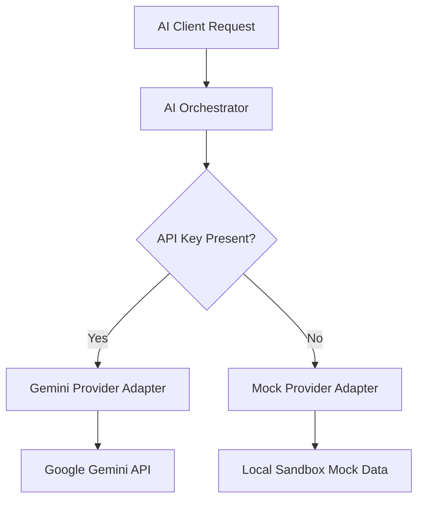

# AI Provider Audit Report

This report evaluates the status, configuration, and architecture of the AI Provider implementations within the Companio AI workspace.

---

## 1. Audit Responses

### 1. Is a Mock AI Provider implemented?

Yes, the `MockProviderAdapter` class is fully implemented and operational.

### 2. Which files implement it?

- **[`apps/web/src/features/ai/adapters/mockAdapter.ts`](file:///c:/Users/muham/Desktop/Network%20System%20projects/Companio%20Ai/apps/web/src/features/ai/adapters/mockAdapter.ts)** — Implements the `AiProvider` interface with static text and JSON content completions.

### 3. How is the provider selected?

The active provider is dynamically instantiated in **[`aiOrchestrator.ts`](file:///c:/Users/muham/Desktop/Network%20System%20projects/Companio%20Ai/apps/web/src/features/ai/services/aiOrchestrator.ts#L8-L14)** inside `getActiveProvider()`:

```typescript
function getActiveProvider(): AiProvider {
  const geminiKey = process.env.GEMINI_API_KEY
  if (geminiKey && geminiKey.trim().length > 0) {
    return new GeminiProviderAdapter(geminiKey)
  }
  return new MockProviderAdapter()
}
```

### 4. Is provider switching supported?

- **Environment-based switching:** Yes. Adding or removing the `GEMINI_API_KEY` environment variable switches the active adapter.
- **Runtime switching:** Although the **Admin Settings Panel** supports saving the active provider (`aiProvider`) in the database `SystemSetting` table, the `aiOrchestrator.ts` does **not** currently query this table to select the runtime adapter.

### 5. Which providers currently exist?

- **Mock** (`MockProviderAdapter`) — Simulates prompt completions with zero external calls.
- **Gemini** (`GeminiProviderAdapter`) — Integrates with the official `@google/generative-ai` SDK.
- **Others:** None.

### 6. Which provider is currently the default?

- **Gemini** is the default if `GEMINI_API_KEY` is present.
- **Mock** serves as the automatic fallback if the key is empty or undefined.

### 7. Does the application work without any AI API keys?

Yes. If `GEMINI_API_KEY` is left blank, the application automatically falls back to Mock mode with no runtime crash.

### 8. Can the entire AI workflow function using only the Mock Provider?

Yes. The Mock Provider accurately mimics structured JSON mode outputs for question generation and text-only formatting summaries.

### 9. Which environment variables are required for each provider?

- **Gemini:** `GEMINI_API_KEY`
- **Mock:** None.

### 10. What is still missing from the AI provider architecture?

- **Database Integration:** The `aiOrchestrator.ts` needs to be updated to query the database `SystemSetting` table to check if the admin selected the "Mock" or "Gemini" provider at runtime, rather than relying solely on environment variables.
- **Dynamic Mock Generation:** The Mock adapter returns static organic chemistry text. It does not parse the input variables to customize question structures.

---

## 2. AI Provider Architecture Diagram



---

## 3. Recommendations

### Current Default Provider

- **Mock mode** (unless `GEMINI_API_KEY` is configured in development env files).

### Production Recommendation

- Configure a valid `GEMINI_API_KEY` in environment variables. Ensure Google Gemini endpoints are active with appropriate rate limit rules.

### Development Recommendation

- Use the **Mock Provider** during local coding and testing to avoid unnecessary API cost charges and request latency.
