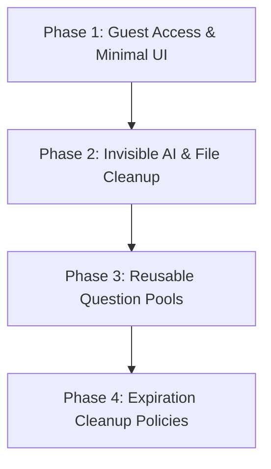

# Product Gap Analysis

This document evaluates the current implementation of the Companio AI platform against the [`MASTER_PRODUCT_SPECIFICATION.md`](file:///c:/Users/muham/Desktop/Network%20System%20projects/Companio%20Ai/docs/MASTER_PRODUCT_SPECIFICATION.md), which serves as the highest-level source of truth.

---

## 1. High Priority Gaps (Core Flow & Guest Access)

### Gap 1: Mandatory Registration for Creation & Generation

- **Requirement:** Guest users must be able to create assessments, share code, complete them, and view leaderboards without registration. Registration should not be mandatory.
- **Current State:** Pages like `/generate` and the assessment template creation are guarded by `AuthGuard` or require login. Guests cannot generate questions or publish templates.
- **Affected Files:**
  - [`apps/web/app/generate/page.tsx`](file:///c:/Users/muham/Desktop/Network%20System%20projects/Companio%20Ai/apps/web/app/generate/page.tsx)
  - [`apps/web/app/actions/assessments.ts`](file:///c:/Users/muham/Desktop/Network%20System%20projects/Companio%20Ai/apps/web/app/actions/assessments.ts)
  - [`apps/web/src/features/auth/components/AuthGuard.tsx`](file:///c:/Users/muham/Desktop/Network%20System%20projects/Companio%20Ai/apps/web/src/features/auth/components/AuthGuard.tsx)
- **Estimated Effort:** Medium (4-6 hours)
- **Recommended Order:** 1

### Gap 2: Homepage Theme and Layout

- **Requirement:** Minimal design with a white background, neutral colors, professional typography, and rounded cards. Primary buttons: "Create Assessment" and "Join Assessment".
- **Current State:** The landing page features a dark theme (`bg-slate-950`) with vibrant violet/blue radial glows and buttons linking to the registration page.
- **Affected Files:**
  - [`apps/web/app/page.tsx`](file:///c:/Users/muham/Desktop/Network%20System%20projects/Companio%20Ai/apps/web/app/page.tsx)
- **Estimated Effort:** Medium (3-4 hours)
- **Recommended Order:** 2

### Gap 3: Invisible AI Branding

- **Requirement:** AI must remain completely invisible. Avoid robot icons, chat interfaces, neon AI themes, and "Powered by AI" banners.
- **Current State:** The homepage and generator screens explicitly mention "Google Gemini AI", "AI-Powered", and use stars/sparkle icons.
- **Affected Files:**
  - [`apps/web/app/page.tsx`](file:///c:/Users/muham/Desktop/Network%20System%20projects/Companio%20Ai/apps/web/app/page.tsx)
  - [`apps/web/app/generate/page.tsx`](file:///c:/Users/muham/Desktop/Network%20System%20projects/Companio%20Ai/apps/web/app/generate/page.tsx)
- **Estimated Effort:** Low (1-2 hours)
- **Recommended Order:** 3

---

## 2. Medium Priority Gaps (Cost Optimization & File Retention)

### Gap 4: Question Pool Reuse (AI Caching)

- **Requirement:** Implement a cache lookup workflow. When a topic is requested, match against existing database questions (e.g. topic matching) and reuse them before calling the AI generator.
- **Current State:** AI generation is called on every request, generating new questions on the fly.
- **Affected Files:**
  - [`apps/web/app/actions/generation.ts`](file:///c:/Users/muham/Desktop/Network%20System%20projects/Companio%20Ai/apps/web/app/actions/generation.ts)
  - [`apps/web/app/actions/practice.ts`](file:///c:/Users/muham/Desktop/Network%20System%20projects/Companio%20Ai/apps/web/app/actions/practice.ts)
- **Estimated Effort:** High (6-8 hours)
- **Recommended Order:** 4

### Gap 5: Temporary Document Storage

- **Requirement:** Uploaded notes should be temporary. The system must extract text, generate questions, and immediately delete the source file from storage and db metadata records to optimize storage costs.
- **Current State:** Uploaded notes are saved permanently in the Supabase private bucket and registered in the `Source` table database.
- **Affected Files:**
  - [`apps/web/app/actions/sources.ts`](file:///c:/Users/muham/Desktop/Network%20System%20projects/Companio%20Ai/apps/web/app/actions/sources.ts)
- **Estimated Effort:** Medium (3-5 hours)
- **Recommended Order:** 5

---

## 3. Low Priority Gaps (UI/UX Polish & Expiry)

### Gap 6: Guest Assessment Records Expiration

- **Requirement:** Guest assessments/attempts should expire automatically after a configurable period.
- **Current State:** Guest responses are stored indefinitely in database tables.
- **Affected Files:**
  - [`packages/db/prisma/schema.prisma`](file:///c:/Users/muham/Desktop/Network%20System%20projects/Companio%20Ai/packages/db/prisma/schema.prisma)
- **Estimated Effort:** Low (2-3 hours)
- **Recommended Order:** 6

---

# Phased Implementation Roadmap

### Phase 1: Guest Access & Minimal UI

- Redesign the landing page to use a clean white/neutral background with primary buttons for "Create Assessment" and "Join Assessment".
- Modify the `/generate` page and server actions to allow guest creations without requiring login.

### Phase 2: Invisible AI & File Cleanup

- Remove "AI-powered" messaging, Gemini references, and robot/sparkle icons.
- Update document processing actions to delete source files from Supabase immediately after generating questions.

### Phase 3: Reusable Question Pools

- Implement a search and match function inside the generation logic to check for existing questions on the requested topic before calling the AI API.

### Phase 4: Expiration Cleanup Policies

- Add scheduler scripts or cleanup flags to automatically purge guest assessment attempts older than 30 days.
